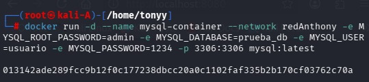
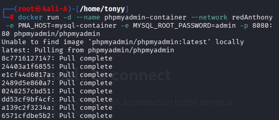

# Práctica: Servidor Web con Docker, MySQL y phpMyAdmin

## Implementación de contenedores Docker con MySQL y phpMyAdmin en red personalizada

---

## Duración
**120 minutos**

---

## Fundamentos

Docker es una herramienta que permite crear, ejecutar y gestionar **contenedores** — entornos aislados que contienen todo lo necesario para que una aplicación funcione correctamente (librerías, dependencias y configuraciones), evitando problemas de compatibilidad entre sistemas operativos.

En esta práctica se utilizaron los siguientes servicios:

- **MySQL** — Sistema de gestión de bases de datos relacional para almacenar y organizar información de forma estructurada.
- **phpMyAdmin** — Herramienta web con interfaz gráfica para administrar bases de datos sin depender exclusivamente de comandos.
- **Red personalizada Docker** — Permite la comunicación entre contenedores usando nombres en lugar de direcciones IP.

---

## Conocimientos previos requeridos

- Comandos básicos de Linux
- Uso de Docker
- Manejo de navegador web
- Conceptos básicos de redes
- Bases de datos relacionales

---

## Objetivos

- [ ] Implementar un contenedor con MySQL
- [ ] Implementar un contenedor con phpMyAdmin
- [ ] Crear una red personalizada en Docker
- [ ] Establecer comunicación entre contenedores
- [ ] Administrar bases de datos desde la interfaz web

---

## Equipo necesario

| Recurso | Detalle |
|--------|---------|
| Sistema operativo | Windows / Linux / macOS |
| Software | Docker instalado |
| Interfaz | Navegador web |
| Conectividad | Conexión a internet |

---

## Material de apoyo

- [Documentación oficial de Docker](https://docs.docker.com/)
- [Docker Hub](https://hub.docker.com/)
- Guía de la asignatura
- Cheat sheet de Linux

---

## Procedimiento

### Paso 1 — Crear la red personalizada

```bash
docker network create redAnthony
```


---

### Paso 2 — Crear el contenedor MySQL

```bash
docker run -d \
  --name mysql-container \
  --network redAnthony \
  -e MYSQL_ROOT_PASSWORD=admin \
  -e MYSQL_DATABASE=prueba_db \
  -e MYSQL_USER=usuario \
  -e MYSQL_PASSWORD=1234 \
  -p 3306:3306 \
  mysql:latest
```




---

### Paso 3 — Crear el contenedor phpMyAdmin

```bash
docker run -d \
  --name phpmyadmin-container \
  --network redAnthony \
  -e PMA_HOST=mysql-container \
  -e MYSQL_ROOT_PASSWORD=admin \
  -p 8080:80 \
  phpmyadmin/phpmyadmin
```




---

### Acceso a phpMyAdmin

Una vez levantados los contenedores, abre el navegador y dirígete a:

```
http://localhost:8080
```

Credenciales de acceso:

| Campo | Valor |
|-------|-------|
| Servidor | `mysql-container` |
| Usuario | `usuario` |
| Contraseña | `1234` |

---

## Resultados esperados

Se implementaron correctamente los contenedores de **MySQL** y **phpMyAdmin** dentro de una red personalizada en Docker. Ambos servicios se comunicaron utilizando el nombre del contenedor como referencia (`PMA_HOST=mysql-container`). Finalmente, se creó una base de datos de prueba (`prueba_db`), comprobando que la conexión entre contenedores funcionó correctamente.

---

## Bibliografía

- Docker Inc. (2023). *Docker Documentation*. https://docs.docker.com/
- MySQL. (2023). *MySQL Documentation*. https://dev.mysql.com/doc/
- phpMyAdmin. (2023). *phpMyAdmin Documentation*. https://www.phpmyadmin.net/docs/
